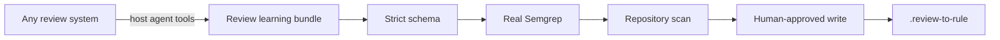

<div align="center">


<br>

[](https://github.com/vamgan/review-to-rule/stargazers)
[](https://www.npmjs.com/package/review-to-rule)
[](https://github.com/vamgan/review-to-rule/actions/workflows/ci.yml)
[](LICENSE)

**A reviewer catches it once. Every future change gets the rule.**

`review-to-rule` turns accepted code-review feedback into a tested Semgrep
guardrail—whether the review came from GitHub, GitLab, Bitbucket, Gerrit,
Azure Repos, or a private system your coding agent can access.

</div>

## Add it to your agent

Run one command in the repository you want to protect:

```bash
# Claude Code
npx skills add vamgan/review-to-rule \
  --skill review-to-rule-write \
  --agent claude-code \
  --yes

# Codex
npx skills add vamgan/review-to-rule \
  --skill review-to-rule-write \
  --agent codex \
  --yes
```

Then ask:

> Turn this accepted review into a rule: `<PR, MR, change, or comment URL>`

No global `review-to-rule` install, `gh auth login`, model API key, or provider
configuration is needed. The skill uses your agent's existing review-system
access and runs the published validator through `npx` when the binary is not
already available.

The one external validation dependency is
[Semgrep](https://semgrep.dev/docs/getting-started/quickstart):

```bash
pipx install semgrep
```

The skill runs `review-to-rule doctor --agent`, retrieves the accepted review
and before/after revisions, creates a temporary provider-neutral bundle, and
shows a complete dry run. Nothing is saved until you approve both the policy
location (`AGENTS.md`, `CLAUDE.md`, both, or neither) and the exact write plan.

## One review becomes executable memory

```text
review
  “This invoice query must include tenantId or it can expose another customer.”

accepted fix
  db.invoice.findMany({ where: { tenantId } })

validated guardrail
  ✓ unsafe fixture matches
  ✓ accepted fixture does not match
  ✓ allowed alternative does not match
  ✓ meaning-preserving mutations still match
  ✓ current repository scanned
```



The agent retrieves context and proposes one narrow rule. The deterministic
core—not the agent—decides whether the schema, rule, fixtures, mutation checks,
repository scope, and write plan are valid.

Feedback that is subjective, behavioral, ambiguous, or too broad is refused
instead of becoming a brittle rule.

## What gets stored

The repository owns its future review memory:

```text
.review-to-rule/
├── rules/       # validated Semgrep YAML
├── evidence/    # bounded review provenance
├── fixtures/    # before / after / allowed regression cases
└── manifests/   # hashes, expectations, approval, replay metadata
```

`.review-to-rule/` is canonical. Optional managed blocks in `AGENTS.md` and
`CLAUDE.md` only point agents to the stored rule and replay command; rule logic
is never duplicated there.

Future validation is offline and deterministic:

```bash
npx review-to-rule@latest validate-all .review-to-rule --repo-dir .
npx review-to-rule@latest replay .review-to-rule/manifests/<rule>.json
```

## Standalone GitHub adapter

The agent workflow above is the default. If you intentionally run without a
capable host agent, the optional standalone adapter can retrieve one GitHub
review and call OpenAI or Anthropic itself:

```bash
gh auth login
export OPENAI_API_KEY=...

npx review-to-rule@latest doctor
npx review-to-rule@latest generate \
  'https://github.com/owner/repo/pull/123#discussion_r456'
```

`gh` authentication and a model credential are required only for this adapter.
They are not required for `apply`, `validate`, `validate-all`, `scan`, or
`replay`.

For custom integrations, emit a versioned
[review learning bundle](docs/REVIEW_BUNDLE.md) and run:

```bash
npx review-to-rule@latest apply review-bundle.json --repo-dir .
```

## Safety

- Dry run by default; writes require a reviewed preview and explicit approval.
- Credential-free, bounded bundles; embedded URL credentials are rejected.
- Exactly one strict rule; no autofix or unknown Semgrep fields.
- Real before/after/allowed fixtures plus mutation and repository checks.
- No target builds, tests, hooks, package scripts, or generated commands run.
- Contained, symlink-aware, journaled writes with rollback and replay hashes.
- Change-request publication is a separate opt-in and never auto-merges.

There is no account, daemon, telemetry, or background learner. See the full
[architecture](docs/ARCHITECTURE.md) and [security model](docs/SECURITY.md).

## Development

```bash
npm ci
npm run release:check
```

The checked-in demo needs no GitHub login or model key: `npm run demo`.
Contributions are welcome—start with [CONTRIBUTING.md](CONTRIBUTING.md).

MIT licensed.
