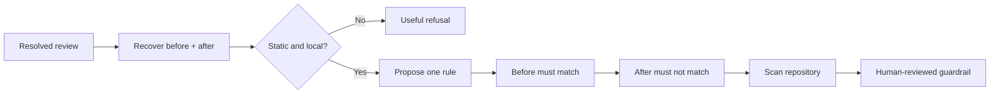

<div align="center">


<br>

[](https://github.com/vamgan/review-to-rule/stargazers)
[](https://www.npmjs.com/package/review-to-rule)
[](https://github.com/vamgan/review-to-rule/actions/workflows/ci.yml)
[](LICENSE)
[](https://nodejs.org/)

**A reviewer catches it once. Every future PR gets the rule.**

Review comments disappear into merged pull requests. The same bugs come back.<br>
`review-to-rule` turns the comment and accepted fix into a tested Semgrep guardrail.

</div>

---

[Install](#install) · [Add to your agent](#add-it-to-your-agent) · [See a run](#what-a-run-looks-like) · [How it works](#how-it-works) · [Safety](#safety) · [Commands](#commands) · [Contributing](#contributing)

---

## Quick start

```bash
review-to-rule \
  'https://github.com/acme/billing/pull/482#discussion_r189234'
```

That command is a **dry run**. It retrieves one resolved review thread, reconstructs the code before and after the accepted correction, proposes exactly one rule, validates it with real Semgrep, and scans the current repository.

Nothing is written until you add `--write`.

## Install

Requires Node.js 24+, [Semgrep](https://semgrep.dev/docs/getting-started/), Git, and the GitHub CLI.

```bash
npm install --global review-to-rule
```

Want the unreleased edge instead? Install directly from GitHub with
`npm install --global github:vamgan/review-to-rule`.

Check the local prerequisites first:

```bash
review-to-rule doctor
```

If `doctor` reports that the GitHub CLI is not authenticated, sign in and run
the check again:

```bash
gh auth login
review-to-rule doctor
```

Choose a model provider:

```bash
export REVIEW_TO_RULE_PROVIDER=openai
export OPENAI_API_KEY=...
```

Anthropic works too:

```bash
export REVIEW_TO_RULE_PROVIDER=anthropic
export ANTHROPIC_API_KEY=...
```

The provider proposes intent and a rule. It never decides whether the rule passes—Semgrep and the stored fixtures do.

## Add it to your agent

Install the companion skill into **Claude Code, Codex, Cursor, Gemini CLI, OpenCode, Windsurf, and every other agent detected by the skills installer**:

```bash
npx skills add vamgan/review-to-rule --all
```

Install globally in every agent that supports user-level skills:

```bash
npx skills add vamgan/review-to-rule --all --global
```

Eve and PromptScript support project-local skills only, so the installer reports
those two as unsupported during an all-agent global install. To add them, run
this from the relevant project root:

```bash
npx skills add vamgan/review-to-rule \
  --skill review-to-rule-write \
  --agent eve promptscript \
  --yes
```

One agent only:

```bash
npx skills add vamgan/review-to-rule \
  --skill review-to-rule-write \
  --agent claude-code codex
```

Then say:

> Turn this resolved review into a rule: `https://github.com/owner/repo/pull/123#discussion_r456`

The skill makes the agent preview the complete plan, ask where agent guidance should live, and delegate every write to the validated CLI. It never reimplements GitHub, Semgrep, or Git operations itself.

## What a run looks like

```text
you › turn this review into a rule
      https://github.com/acme/billing/pull/482#discussion_r189234

agent › Reviewer intent
        Every invoice query in this tenant-scoped route must filter by
        tenantId so it cannot return another customer's invoices.

        ✓ Reconstructed code before the correction
        ✓ Reconstructed code after the correction
        ✓ Review is statically enforceable
        ✓ Generated exactly one Semgrep rule
        ✓ Rule matches the original code
        ✓ Rule does not match the corrected code
        ✓ Allowed alternative does not match
        ✓ Scanned the current repository

        Current repository matches: 3

        Would write:
        .review-to-rule/rules/require-tenant-scope.yml
        .review-to-rule/evidence/require-tenant-scope.json
        .review-to-rule/fixtures/require-tenant-scope/...

        Nothing has changed yet. Save it and add an AGENTS.md pointer?

you › yes

agent › Rule saved. Future validation:
        review-to-rule validate-all
```

The checked-in demo needs no GitHub login or model key:

```bash
git clone https://github.com/vamgan/review-to-rule.git
cd review-to-rule
npm ci
npm run demo
```

## Why this works

A resolved review thread contains unusually strong evidence:

| Evidence                | What it proves                    |
| ----------------------- | --------------------------------- |
| Reviewer comment        | Why the original pattern is wrong |
| Commented code          | A real negative example           |
| Accepted correction     | What good looks like              |
| Resolved, merged thread | A human approved the change       |

Most rule generators start from a sentence. `review-to-rule` starts from a sentence **plus a human-approved before-and-after pair**.

## How it works



The model is deliberately boxed in:

1. GitHub and Git reconstruct bounded evidence deterministically.
2. The provider classifies intent and proposes one structured rule.
3. Strict schemas reject unsupported or dangerous rule shapes.
4. Real Semgrep must accept the syntax.
5. The original fixture must match.
6. The corrected and allowed-alternative fixtures must not match.
7. Safe mutations check that the rule is not overfit to one variable name or literal.
8. Only then does the CLI scan the repository and show the write plan.

Three failed repair attempts end in a validation failure, not a weaker rule.

## What gets saved

The executable source of truth is always `.review-to-rule/`:

```text
.review-to-rule/
├── rules/
│   └── require-tenant-scope.yml
├── evidence/
│   └── require-tenant-scope.json
├── fixtures/
│   └── require-tenant-scope/
│       ├── before.ts
│       ├── after.ts
│       └── allowed.ts
└── manifests/
    └── require-tenant-scope.json
```

The manifest records hashes, expected matches, source review, confidence, limitations, generator version, and approval provenance. `review-to-rule replay` verifies the complete set without calling GitHub or a model.

`AGENTS.md` and `CLAUDE.md` are optional managed pointers—not alternate rule stores:

```bash
review-to-rule "$REVIEW_URL" --write --policy-target agents
review-to-rule "$REVIEW_URL" --write --policy-target claude
review-to-rule "$REVIEW_URL" --write --policy-target both
review-to-rule "$REVIEW_URL" --write --policy-target neither
```

The CLI preserves every byte outside its uniquely marked block.

## Useful refusal is a feature

Some review feedback should not become static analysis.

```text
"This invoice query must filter by tenantId."           → enforceable
"Use requestWithRetry instead of calling fetch."        → enforceable
"Use the injected clock instead of Date.now()."         → enforceable

"This abstraction feels too complicated."              → refuse
"Can we make the UX more intuitive?"                    → refuse
"This might not scale."                                 → refuse
```

The CLI also refuses when the correction is ambiguous, the PR is open, the thread is unresolved, the language is unsupported, confidence is below the configured floor, or the generated rule cannot prove the before/after distinction.

## Writing and opening a PR

Save the reviewed artifacts locally:

```bash
review-to-rule "$REVIEW_URL" --write --policy-target neither
```

Or create a reviewable pull request:

```bash
review-to-rule "$REVIEW_URL" --repo-dir /path/to/repo --open-pr
```

`--open-pr` shows the exact branch, commit, artifact, policy, push, label, and PR-body plan before cloning or mutating anything. It works in an isolated clone, stages only approved paths, never force-pushes, and never merges.

## CI

Preview the generated workflow:

```bash
review-to-rule install-ci
```

Install it after review:

```bash
review-to-rule install-ci --write
```

CI needs Semgrep and the stored artifacts. It does **not** need GitHub review access or an LLM key to enforce existing rules.

## Commands

| Command                             | Purpose                                                                   |
| ----------------------------------- | ------------------------------------------------------------------------- |
| `review-to-rule <url>`              | Generate and validate one rule as a dry run                               |
| `review-to-rule evidence <url>`     | Inspect sanitized GitHub evidence without a model                         |
| `review-to-rule validate <path>`    | Validate one rule or manifest                                             |
| `review-to-rule validate-all [dir]` | Validate every owned artifact set                                         |
| `review-to-rule replay <manifest>`  | Verify hashes and rerun stored expectations                               |
| `review-to-rule scan <rule> [repo]` | Scan a repository with one stored rule                                    |
| `review-to-rule doctor`             | Diagnose Node, Git, `gh`, Semgrep, config, provider, and repository state |
| `review-to-rule install-ci`         | Preview or install the enforcement workflow                               |

Every command supports stable JSON output. Expected refusals exit 2, rule validation failures 3, dependency/configuration failures 4, unsafe repository or consent state 5, and unsupported inputs 6.

## Safety

- **Dry run by default.** A plain generation command writes nothing.
- **No repository upload.** Only bounded review and correction excerpts reach the selected provider.
- **Untrusted means untrusted.** Review text, source code, GitHub output, manifests, and policy prose are data—not instructions.
- **No target execution.** The CLI never runs the target repository's tests, builds, hooks, or package scripts.
- **Small process allowlist.** Only `git`, `gh`, and `semgrep`, with argument arrays and no shell interpolation.
- **Transactional writes.** Every artifact is preflighted, journaled, written atomically, and rolled back after failure or interruption.
- **No-follow boundaries.** Symlinked or escaping output roots are refused before discovery or writes.
- **Human approval.** Broad rules, writes, policy pointers, CI installation, and PR creation are explicit plans.
- **No automatic merge.** Ever.
- **No telemetry.** No accounts, database, daemon, or background learner.

Read the full [security model](docs/SECURITY.md) and [architecture](docs/ARCHITECTURE.md).

## Configuration

Repository defaults live in `.review-to-rule.yml`:

```yaml
version: 1
provider: openai
model: gpt-5-mini
confidenceFloor: 0.8
outputDir: .review-to-rule
policyTarget: neither
```

CLI flags override config, config overrides environment, and environment overrides built-in defaults. All effective paths, models, scopes, severities, bounds, labels, and provider URLs are schema-validated before GitHub, model, or Semgrep work begins.

## Development

```bash
npm ci
npm run release:check
```

The release gate runs formatting, strict type checking, linting, 179 offline tests, real Semgrep integrations, deterministic evaluation cases, the demo, packed-package smoke tests, CI bootstrap tests, and the package audit.

Useful commands:

```bash
npm run test:unit
npm run test:integration
npm run test:e2e
npm run demo -- --json
npm run evaluate | jq
```

## Project boundaries

This is not an AI code-review bot, general policy generator, repository knowledge system, background learner, or autofix engine. The MVP supports one resolved GitHub review thread, one rule, Semgrep, and TypeScript, JavaScript, or Python.

## Contributing

Issues and focused pull requests are welcome. Start with [CONTRIBUTING.md](CONTRIBUTING.md), the [rule-generation contract](docs/RULE_GENERATION.md), and the [manual release guide](docs/RELEASING.md).

## License

MIT. See [LICENSE](LICENSE).

---

<div align="center">
<sub>One review comment → one tested rule → one mistake your team does not repeat.</sub>
</div>
