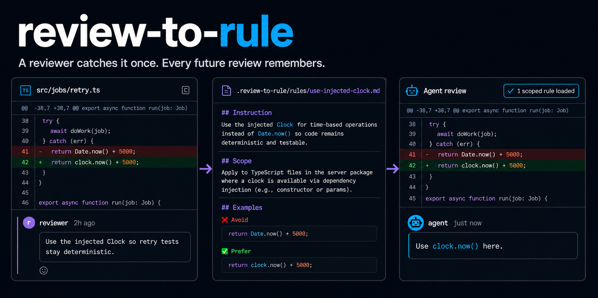
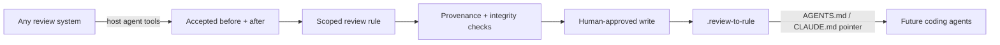

<div align="center">



<br>

[](https://github.com/vamgan/review-to-rule/stargazers)
[](https://www.npmjs.com/package/review-to-rule)
[](https://github.com/vamgan/review-to-rule/actions/workflows/ci.yml)
[](LICENSE)

**A reviewer catches it once. Every future review remembers.**

`review-to-rule` turns accepted code-review feedback into durable, scoped
repository memory—whether the review came from GitHub, GitLab, Bitbucket,
Gerrit, Azure Repos, or a private system your coding agent can access.

</div>

## Add it to your agent

### Claude Code plugin

Run these commands inside Claude Code:

```text
/plugin marketplace add vamgan/review-to-rule
/plugin install review-to-rule@review-to-rule
/reload-plugins
```

Then invoke it directly:

```text
/review-to-rule:review-to-rule-write Turn this accepted review into a rule: <PR, MR, change, or comment URL>
```

### Codex

```bash
npx skills add vamgan/review-to-rule \
  --skill review-to-rule-write \
  --agent codex \
  --yes
```

Then ask:

> Turn this accepted review into a rule: `<PR, MR, change, or comment URL>`

That is the whole agent installation. No separate `review-to-rule` CLI, npm
package install, `gh auth login`, model API key, or provider configuration is
needed. The plugin and portable skill both include the deterministic helper
used for previews, writes, and validation. Runtime requirements are Node.js 24+
and Git.

The skill retrieves the accepted review and its before/after revisions, creates
a temporary provider-neutral bundle, and shows a complete dry run. Nothing is
saved until you choose `AGENTS.md`, `CLAUDE.md`, both, or neither—and approve
the exact write plan.

## One review becomes shared memory

```text
review
  “Use the injected Clock here so retry tests stay deterministic.”

accepted fix
  return clock.now() + retryDelay

stored rule
  scope: src/jobs/*.ts
  flag: direct wall-clock reads when Clock is available
  prefer: clock.now()

future agent review
  “Use clock.now() here.”
```



The agent understands the review. The core verifies bounded evidence, accepted
before/after examples, scope coverage, credentials, collisions, hashes, index
consistency, and the complete write transaction.

Rules can capture correctness, security, architecture, behavior, testing,
performance, style, maintainability, and product constraints. Ambiguous,
one-off, unsupported, or dangerously broad feedback is refused.

## What gets stored

The repository owns its future review memory:

```text
.review-to-rule/
├── INDEX.md      # scope-aware directory for agents
├── rules/        # readable Markdown review rules
├── evidence/     # bounded accepted review provenance
└── manifests/    # structured rules, hashes, and approval metadata
```

`.review-to-rule/` is canonical. Optional managed blocks in `AGENTS.md` and
`CLAUDE.md` tell agents to read the index and load only rules matching the files
they are reviewing. Rule logic is never duplicated there.

Integrity validation is local and deterministic. During an agent run, the
installed skill uses its bundled helper to validate the complete write and
replay its manifest; it does not download or look up another executable.

## Optional npm CLI

You do not need this section for Claude Code or Codex. Install or invoke the npm
CLI only for terminal automation, CI, or the standalone GitHub adapter:

```bash
npx review-to-rule@latest validate-all .review-to-rule --repo-dir .
npx review-to-rule@latest replay .review-to-rule/manifests/<rule>.json
```

If you intentionally run without a capable host agent, the standalone adapter
can retrieve one GitHub review and call OpenAI or Anthropic itself:

```bash
gh auth login
export OPENAI_API_KEY=...

npx review-to-rule@latest doctor
npx review-to-rule@latest generate \
  'https://github.com/owner/repo/pull/123#discussion_r456'
```

`gh` authentication and a model credential are required only for this adapter.
They are not required for `apply`, `validate`, `validate-all`, or `replay`.

For custom integrations, emit a versioned
[review-memory bundle](docs/REVIEW_BUNDLE.md) and run:

```bash
npx review-to-rule@latest apply review-bundle.json --repo-dir .
```

## Safety

- Dry run by default; writes require a reviewed preview and explicit approval.
- Credential-free, bounded bundles; embedded URL credentials are rejected.
- Exactly one scoped, agent-readable rule anchored to the accepted correction.
- Structural, provenance, credential, hash, index, and pointer validation.
- No target builds, tests, hooks, package scripts, or generated commands run.
- Contained, symlink-aware, journaled writes with rollback and replay hashes.
- Change-request publication is a separate opt-in and never auto-merges.

There is no account, daemon, telemetry, or background learner. See the full
[architecture](docs/ARCHITECTURE.md) and [security model](docs/SECURITY.md).

## Development

```bash
npm ci
npm run release:check
```

Contributions are welcome—start with [CONTRIBUTING.md](CONTRIBUTING.md).

MIT licensed.
