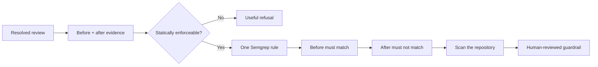
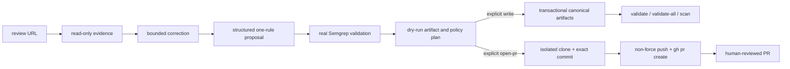

# review-to-rule

> **Never leave the same code-review comment twice.**

Turn a resolved GitHub review comment into a tested Semgrep guardrail—then stop the same mistake before it gets merged again.

[](https://github.com/vamgan/review-to-rule/actions/workflows/ci.yml)
[](https://www.npmjs.com/package/review-to-rule)
[](LICENSE)
[](https://nodejs.org/)

```sh
npx review-to-rule \
  'https://github.com/acme/payments/pull/482#discussion_r189234'
```

```text
Analyzing review thread...

Reviewer intent
Use the injected Clock abstraction instead of Date.now()
so behavior remains deterministic in tests.

✓ Reconstructed code before the correction
✓ Reconstructed code after the correction
✓ Review is statically enforceable
✓ Generated exactly one Semgrep rule
✓ Rule matches the original code
✓ Rule does not match the corrected code
✓ Scanned the current repository

Current repository matches: 3
Rule: .review-to-rule/rules/use-injected-clock.yml

Dry run complete. Add --write only after reviewing the result.
```

## The idea

A resolved review thread contains something most rule generators do not: human-approved training evidence.

| Review evidence             | What it proves              |
| --------------------------- | --------------------------- |
| The reviewer comment        | Why the pattern is wrong    |
| The commented code          | A real negative example     |
| The accepted correction     | What good looks like        |
| The merged, resolved thread | A human approved the change |

`review-to-rule` converts that evidence into **one rule with executable proof**. The model proposes; deterministic reconstruction, strict schemas, and real Semgrep decide whether the rule is safe enough to keep. If the evidence is ambiguous, behavioral, subjective, or overbroad, the CLI refuses.



### Why teams reach for it

- **Tiny workflow:** one review comment in, one tested rule out.
- **Dry-run first:** the default command writes nothing.
- **Proof over vibes:** every saved rule must pass its original and corrected fixtures.
- **Safe refusal:** low-confidence feedback produces an explanation, not a fragile rule.
- **Private by design:** only bounded review evidence is sent to the selected provider—never the whole repository.
- **Future enforcement:** saved rules can run locally, in CI, or from an optional `AGENTS.md` / `CLAUDE.md` pointer.

## Quick start

Prerequisites are Node.js 24+ and Semgrep on `PATH`.

```sh
npm ci
npm run build
npm run demo
npm run demo -- --json
```

The checked-in demo uses a direct `Date.now()` call before the review and an injected `Clock` afterward. It needs no GitHub login, network call, or model key. For live use, authenticate the read-only GitHub CLI and choose exactly one provider:

```sh
gh auth login
export REVIEW_TO_RULE_PROVIDER=openai
export OPENAI_API_KEY=... # or select anthropic with ANTHROPIC_API_KEY
review-to-rule generate "$REVIEW_URL"
```

Provider selection is `--provider`/config, then `REVIEW_TO_RULE_PROVIDER`, then an unambiguous single provider key. Both provider keys are an error. The deterministic fake provider is available only with an explicit checked-in fixture.

Example `.review-to-rule.yml`:

```yaml
version: 1
provider: openai
model: gpt-5-mini
confidenceFloor: 0.8
outputDir: .review-to-rule
policyTarget: neither
```

CLI values override explicit or default config, which overrides environment values, which overrides centralized defaults. Model, HTTP(S) base URL, severity, context, scan bound, include/exclude paths, branch prefix, labels, output root, and policy choices are schema validated.

## CLI and persistence

Both generation forms are equivalent:

```sh
review-to-rule generate "$REVIEW_URL"
review-to-rule "$REVIEW_URL"
```

To audit the GitHub boundary without selecting a model or touching a checkout,
use the sanitized read-only evidence surface:

```sh
review-to-rule evidence "$REVIEW_URL" --json
```

`--json` emits one schema-versioned object. Refusals use exit 2, rule validation failures 3, dependency/configuration failures 4, unsafe repository or consent state 5, and unsupported inputs 6.

Dry run is always the default. After inspecting its paths, collision decision, exact-file scope, validation, and policy discovery, persist locally with an explicit policy choice:

```sh
review-to-rule generate "$REVIEW_URL" --write --policy-target neither
review-to-rule generate "$REVIEW_URL" --write --policy-target agents
```

Interactive writes require a TTY and confirmation. `--yes` records non-interactive approval but never opts into policy; unattended policy defaults to `neither`. If multiple nested policy files exist, select an exact `--agents-path` or `--claude-path`. The CLI owns only a unique managed marker block and preserves all other prose.

The canonical artifact root is `.review-to-rule/`: one rule, bounded evidence JSON, before/after and optional allowed fixtures, and a versioned manifest with hashes, source identity, expectations, and approval provenance. Same-rule/same-source reruns replace deterministically; another source receives a numeric suffix. The complete set, including selected managed pointers, is staged and rolled back on failure. Use `--output-dir` for a custom contained root.

Replay a stored manifest without invoking GitHub or a model:

```sh
review-to-rule replay '.review-to-rule/manifests/review-to-rule.example.json'
```

The final public workflow also supports independent validation, aggregate audit,
one-rule scanning, prerequisite diagnosis, and a separately consented CI install:

```sh
review-to-rule validate '.review-to-rule/rules/review-to-rule.example.yml'
review-to-rule validate-all --json
review-to-rule scan '.review-to-rule/rules/review-to-rule.example.yml' --target .
review-to-rule doctor --json
review-to-rule install-ci                         # complete preview only
review-to-rule install-ci --write --yes           # exact atomic install
```

`validate` accepts either a canonical rule or its manifest and always resolves
the same manifest-backed workflow. `validate-all` is stable and exhaustive: it
reports every malformed set, unowned rule, and duplicate ownership, then exits 3
if any item fails. `scan` runs exactly one locally parsed rule with real Semgrep
and emits normalized, bounded matches. `doctor` is read-only and uses pass/warn/
fail/skip checks; a missing required prerequisite exits 4. `install-ci` never
runs generation and refuses a differing existing workflow.

Every command accepts `--debug`; expected failures include sanitized diagnostic
names without environment values, source excerpts, or stacks. An optional
`--debug-bundle <contained-relative-path>` requires TTY approval or `--yes`, is
created atomically without overwrite or symlink following, and deliberately
excludes tokens, environment dumps, authorization headers, stacks, home paths,
source/review excerpts, and policy prose.

To publish from an explicit checkout, `--open-pr` implies the artifact write but
does all work in an isolated clone. Review the dry-run and PR plan first, then
confirm interactively or use `--yes` in an already-reviewed automation:

```sh
review-to-rule generate "$REVIEW_URL" --repo-dir /path/to/repo --open-pr
```

The publisher disables hooks/signing, stages only approved artifacts, never
forces or merges, and uses a fixed `gh pr create` argument list. The caller's
checkout remains byte-for-byte untouched even when dirty. A post-commit failure
retains the isolated checkout and reports its branch, commit, push state, and a
safe retry command.

Replay first requires a canonical complete manifest: its owned and hashed path sets, artifact root/identity, selected policy paths and explicit consent, versioned evidence, supported GitHub review URL, canonical source identity, valid generator SemVer, and stored rule ID must all agree. Each selected `AGENTS.md`/`CLAUDE.md` file must contain exactly one managed block whose manifest, rule directory, validation command, and replay command point to that canonical set. Replay then reruns Semgrep syntax plus before/corrected/allowed expectations at the rule's exact include path. Missing, redirected, changed, inconsistent, or behaviorally invalid files fail without writes. Managed policy sections remain optional pointers, never a second rule store.

## Safety and limitations

- No target-repository code, package script, build, or test is executed.
- Subprocesses are restricted to `git`, `gh`, and `semgrep`, with argument arrays and `shell: false`.
- GitHub access uses read endpoints; unresolved, unmapped, or unmerged evidence fails unless its dedicated allow flag is supplied.
- Repository choice is explicit `--repo-dir`, then a matching current checkout, then a temporary clone whose normalized origin is verified.
- Review/source excerpts are bounded and inert. Policy files, credentials, environment dumps, and arbitrary repository content are never sent to a provider.
- Pull-request creation and CI installation are separate explicit opt-ins. The CLI never merges, force-pushes, comments, publishes packages, sends telemetry, autofixes, or silently activates rules.

## Development

```sh
npm run typecheck
npm run lint
npm test
npm run build
npm run test:smoke
npm run evaluate | jq
npm run release:check
```



The integration and evaluation suites require real Semgrep. If absent, Semgrep-dependent suites report an explicit skip; CI installs it mandatorily. Default tests use temporary repositories, deterministic fixtures, fake transports, and read-only GitHub command contracts. See [Architecture](docs/ARCHITECTURE.md), [Rule generation](docs/RULE_GENERATION.md), and [Security](docs/SECURITY.md).

Set `REVIEW_TO_RULE_LIVE_URL` to a stable public review-comment URL to opt into the authenticated read-only GitHub smoke. The gate invokes the built `review-to-rule evidence` command, compares its sanitized fields to direct `gh api` reads, and never writes to the remote.

## Contributing and license

See [CONTRIBUTING.md](CONTRIBUTING.md), [SECURITY.md](SECURITY.md), the
[Code of Conduct](CODE_OF_CONDUCT.md), and the [manual release guide](docs/RELEASING.md).
This project is available under the MIT License.

## Roadmap

The MVP is intentionally complete at one review thread to one local Semgrep
guardrail. Future work may deepen supported Semgrep patterns and diagnostics,
but automatic merging, autofix, organization-wide learning, background services,
additional forge providers, and automatic publication remain out of scope.
