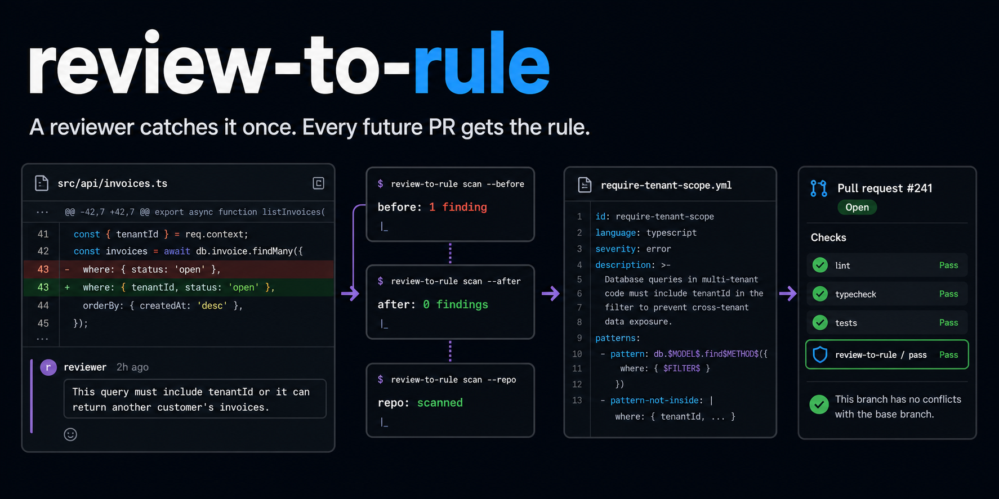
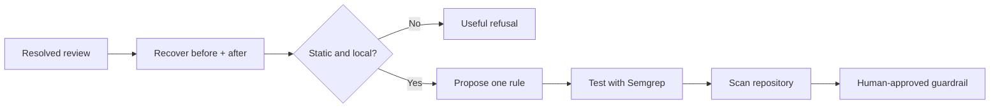

<div align="center">



<br>

[](https://github.com/vamgan/review-to-rule/stargazers)
[](https://www.npmjs.com/package/review-to-rule)
[](https://github.com/vamgan/review-to-rule/actions/workflows/ci.yml)
[](LICENSE)
[](https://nodejs.org/)

**A reviewer catches it once. Every future PR gets the rule.**

Review comments disappear into merged pull requests. The same bugs come back.<br>
`review-to-rule` turns the comment and accepted fix into a tested Semgrep guardrail.

</div>

---

[Add to your agent](#add-it-to-your-agent) · [See a run](#what-a-run-looks-like) · [What gets saved](#what-gets-saved) · [How it works](#how-it-works) · [CLI](#use-the-cli-directly) · [Safety](#safety)

## Add it to your agent

From the repository you want to protect:

```bash
cd your-repository

# Claude Code
npx skills add vamgan/review-to-rule \
  --skill review-to-rule-write \
  --agent claude-code \
  --yes

# Codex
npx skills add vamgan/review-to-rule \
  --skill review-to-rule-write \
  --agent codex \
  --yes

# Or every supported agent in this project
npx skills add vamgan/review-to-rule --all
```

The all-agent option also covers Cursor, Gemini CLI, OpenCode, Windsurf, and the
other agents detected by the installer.

No separate CLI installation is required. The skill uses an existing
`review-to-rule` binary when available and otherwise runs the published package
through `npx`. It starts with `doctor`, which reports missing Node, Semgrep, Git,
GitHub authentication, or provider setup before generation begins.

If `doctor` reports that GitHub is not authenticated, run `gh auth login`. For
live rule generation, provide one model credential:

```bash
export OPENAI_API_KEY=...

# Or use Anthropic
export REVIEW_TO_RULE_PROVIDER=anthropic
export ANTHROPIC_API_KEY=...
```

Then ask your agent:

> Turn this resolved review into a rule: `https://github.com/owner/repo/pull/123#discussion_r456`

The agent previews the evidence, rule, validation, repository matches, and exact
files before asking whether to save anything. It also asks whether the optional
agent pointer should live in `AGENTS.md`, `CLAUDE.md`, both, or neither.

## What a run looks like

```text
you › turn this review into a rule
      https://github.com/acme/billing/pull/482#discussion_r189234

agent › Reviewer intent
        Every invoice query in this tenant-scoped route must filter by
        tenantId so it cannot return another customer's invoices.

        ✓ Reconstructed the code before and after the fix
        ✓ Generated one statically enforceable rule
        ✓ Original code matches; corrected code does not
        ✓ Allowed alternative does not match
        ✓ Scanned the current repository

        Current repository matches: 3

        Would write:
        .review-to-rule/rules/require-tenant-scope.yml
        .review-to-rule/evidence/require-tenant-scope.json
        .review-to-rule/fixtures/require-tenant-scope/...

        Nothing has changed yet. Save it and add an AGENTS.md pointer?

you › yes

agent › Rule saved. Future validation: review-to-rule validate-all
```

The first pass is always a dry run.

## What gets saved

Rules and their proof live together in `.review-to-rule/`:

```text
.review-to-rule/
├── rules/
│   └── require-tenant-scope.yml
├── evidence/
│   └── require-tenant-scope.json
├── fixtures/
│   └── require-tenant-scope/
│       ├── before.ts
│       ├── after.ts
│       └── allowed.ts
└── manifests/
    └── require-tenant-scope.json
```

The manifest records hashes, expectations, source review, confidence,
limitations, generator version, and approval provenance. `review-to-rule replay`
verifies the complete set without GitHub or a model.

`AGENTS.md` and `CLAUDE.md` are optional managed pointers. They never become a
second rule store.

## How it works

A resolved review thread contains unusually strong evidence:

| Evidence                | What it proves                    |
| ----------------------- | --------------------------------- |
| Reviewer comment        | Why the original pattern is wrong |
| Commented code          | A real negative example           |
| Accepted correction     | What good looks like              |
| Resolved, merged thread | A human approved the change       |



The model proposes intent and one structured rule. Deterministic reconstruction,
strict schemas, stored fixtures, and real Semgrep decide whether it passes.

Feedback such as “filter this query by `tenantId`” or “use the injected clock”
can become a rule. Subjective, behavioral, ambiguous, or overly broad feedback
produces a useful refusal instead of a fragile guardrail.

## Use the CLI directly

For direct terminal use—not required by the agent skill—install the CLI once:

```bash
npm install --global review-to-rule
review-to-rule doctor
```

```bash
# Preview one rule; writes nothing
review-to-rule 'https://github.com/owner/repo/pull/123#discussion_r456'

# Save the reviewed artifacts
review-to-rule "$REVIEW_URL" --write --policy-target neither

# Create a reviewable pull request from an isolated clone
review-to-rule "$REVIEW_URL" --repo-dir /path/to/repo --open-pr

# Revalidate every stored rule without GitHub or a model
review-to-rule validate-all

# Install enforcement in CI after previewing the workflow
review-to-rule install-ci --write
```

`--open-pr` stages only approved paths, never force-pushes, and never merges.
Existing rules need Semgrep in CI, but no GitHub review access or model key.
Run `review-to-rule --help` for the complete command reference.

## Safety

- **Dry run by default.** Nothing is written without explicit approval.
- **Bounded model input.** Only the relevant review and correction excerpts are sent.
- **No target execution.** Repository tests, builds, hooks, and package scripts never run.
- **Executable proof.** The original fixture must match; corrected and allowed fixtures must not.
- **Transactional writes.** Paths are preflighted and partial failures roll back.
- **Reviewable automation.** CI and pull requests are separate opt-ins; nothing auto-merges.

There is no account, daemon, telemetry, background learner, or repository-wide
code upload. Read the full [security model](docs/SECURITY.md) and
[architecture](docs/ARCHITECTURE.md).

## Development

```bash
npm ci
npm run release:check
```

The checked-in demo needs no GitHub login or model key: `npm run demo`.
Contributions are welcome—start with [CONTRIBUTING.md](CONTRIBUTING.md).

## License

MIT. See [LICENSE](LICENSE).

---

<div align="center">
<sub>One review comment → one tested rule → one mistake your team does not repeat.</sub>
</div>
